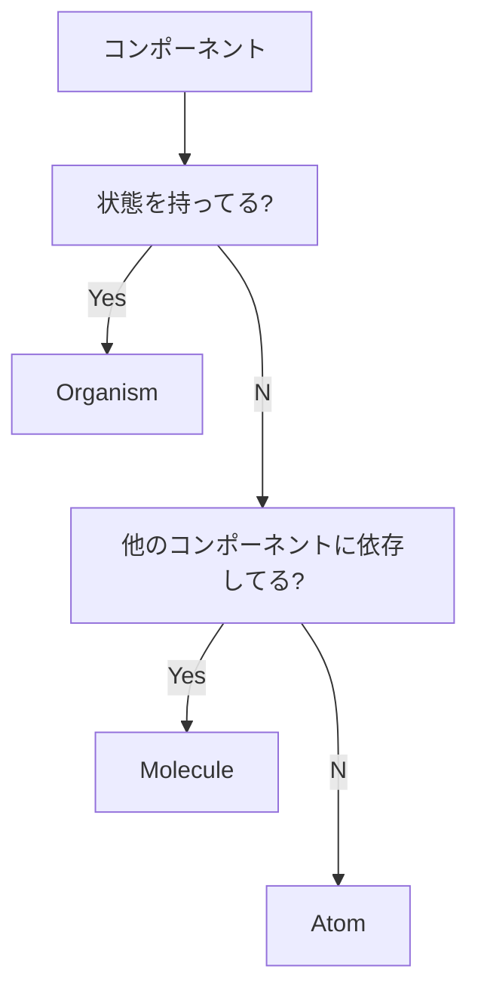

# blog

私の個人ブログです。

- ブログ本体: https://blog.tsuki-yo.net
- タスク管理: https://github.com.s3igo/blog/issues
- プロジェクト管理: https://github.com/users/s3igo/projects/1/views/1

## 背景・方針

プログラミングのこと日常のこと問わず、アウトプットの場が欲しかったので作りました。
詳しくは[こちら](https://blog.tsuki-yo.net/posts/first-post/)へ。

## ディレクトリ構成

### ルート

```shell
$ tree -ad -L 1 -I node_modules -I .git
.
├── .devcontainer  # devcontainerの設定
├── .github        # GitHub Actionsの設定
├── app            # ソースコード
├── contents       # ブログ記事
└── infra          # 開発環境のDockerfile

6 directories
```

npm workspacesを使ってルートから動かず作業するようにしています。

### コンポーネント

```shell
$ tree ./app/src/components -d
./app/src/components
├── atoms
├── molecules
└── organisms

4 directories
```

Atomic Designを参考にしています。
しかし、コンポーネントの粒度が曖昧になりがちな部分を解消するため、
以下のような基準を設け、振り分けるべきディレクトリが明確になるようにしています。



また、TemplateとPageはコンポーネントとして扱わず、
Templateは`./app/src/layouts`に、Pageは`./app/src/pages`に配置しています。
これは、Astroにはデフォルトで`layouts`ディレクトリと`pages`ディレクトリが用意されているためです。

##  技術選定

- 言語: TypeScript
- レンダリングフレームワーク: Astro
- CSSフレームワーク: tailwindCSS(PostCSS)
- リンター: ESLint
- フォーマッター: Prettier
- ドメイン・デプロイ・CDN: Cloudflare
- CI/CD: GitHub Actions

## 開発

### 環境

Git、Docker、GNU makeが必要です。
コンテナの内外どちらでも開発できるようにしてありますが、VSCodeのDev Containerを使うのが最も手っ取り早いです。
VSCodeを使う場合は、workspace機能を利用することを想定しているため、ディレクトリではなく`./blog.code-workspace`を開きます。

### 手法

Issue駆動で開発し、1つのIssueに対して1つのPRを対応させています。
PRは、squash and mergeでマージします。
ブランチ戦略はGit-flowで、releaseブランチは省いています。
