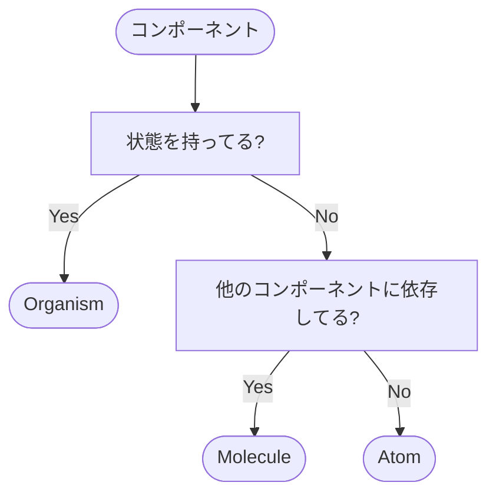

# blog

[](https://github.com/s3igo/blog/actions/workflows/main.yml)
[](https://codecov.io/gh/s3igo/blog)

私の個人ブログです。

- ブログ本体: https://blog.tsuki-yo.net
- RSS: https://blog.tsuki-yo.net/rss.xml
- タスク管理: https://github.com.s3igo/blog/issues
- プロジェクト管理: https://github.com/users/s3igo/projects/1/views/1
- カバレッジ: https://app.codecov.io/gh/s3igo/blog

## 背景・方針

プログラミングのこと日常のこと問わず、アウトプットの場が欲しかったので作りました。
詳しくは[こちら](https://blog.tsuki-yo.net/posts/2023-01-01/first-post)へ。

## 設計思想

任意のエディタで編集できることとロックインを避けることを意識してCMSを使わず、
素のMarkdownで記事を作成しています。
記事の管理は[zk](https://github.com/mickael-menu/zk)を利用しています。

## 技術スタック

- 言語: TypeScript
- パッケージマネージャー: npm
- レンダリングフレームワーク: Astro
- フロントエンドフレームワーク: solid-js
- CSSフレームワーク: tailwindCSS(PostCSS)
- リンター: ESLint
- フォーマッター: Prettier
- ドメイン・デプロイ・CDN: Cloudflare
- 単体テスト: Vitest・solid-testing-library
- E2Eテスト: Playwright
- CI/CD: GitHub Actions

## ディレクトリ構成

### ルート

```shell
$ tree -ad -L 1 -I node_modules -I .git
.
├── .devcontainer  # devcontainerの設定
├── .github        # GitHub Actionsの設定
├── app            # ソースコード
└── infra          # 開発環境のDockerfile

5 directories
```

npm workspacesを使ってルートから動かず作業するようにしています。
記事を書くときのみ、記事実体がある`./app/src/data`に移動して作業します。

### コンポーネント

```shell
$ tree ./app/src/components -d
./app/src/components
├── atoms      # Atom
├── molecules  # Molecule
└── organisms  # Organism

4 directories
```

Atomic Designを参考にしています。
しかし、コンポーネントの粒度が曖昧になりがちな部分を解消するため、
以下のような基準を設け、振り分けるべきディレクトリを明確にしています。



また、TemplateとPageはコンポーネントとして扱わず、
Templateは`./app/src/layouts`に、Pageは`./app/src/pages`に配置しています。
これは、Astroにはデフォルトで`layouts`ディレクトリと`pages`ディレクトリが用意されているためです。

## 開発

### 環境

Git、Docker、GNU makeが必要です。
コンテナ外で記事を書く場合は[zk](https://github.com/mickael-menu/zk)が必要です。
また、`zk edit`コマンドは[fzf](https://github.com/junegunn/fzf)と[bat](https://github.com/sharkdp/bat)に依存しています。
エディタとコンテナの内外を問わず開発できるようにしてありますが、
LSPや拡張機能などの開発支援ツールが設定済みであるVSCodeのDev Containerを使うのがベターです。
VSCodeを使う場合は、Multi-root Workspaces機能を利用することを想定しているため、
プロジェクトフォルダの代わりに`./blog.code-workspace`を開きます。

#### Makefile

Makefileをタスクランナーとして活用し、コンテナ内外で同じコマンドが使えるようにしてあります。
基本的にnpm-scriptsをラップする形でターゲットを定義していますが、
以下に当てはまるもののみ実装して必用以上にコマンドが増えないようにしています。

- 使用頻度が高い
- 複数のコマンドを組み合わせる必要がある
- コンテナ外から実行するのが大変

### 手法

Issue駆動で開発し、PRの`close`コメントでIssueを閉じます。
軽微な変更の場合、Issueを立てずにPRを作成することもあります。
また、PRは`squash and merge`でマージします。
ブランチ戦略はGit-flowでreleaseブランチは省き、
mainブランチにマージすることで本番環境にデプロイされます。
